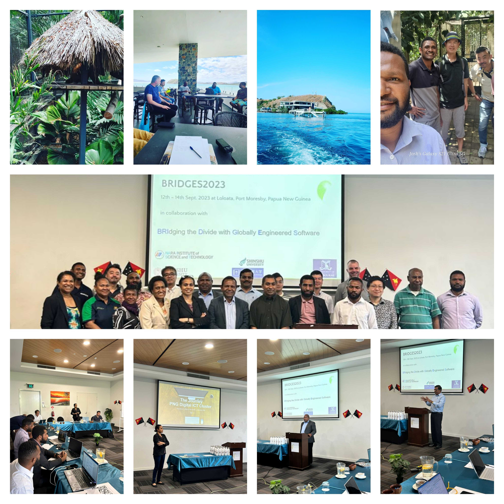

# BRIDGES2023
12th - 14th Sept. 2023 at Loloata, Port Moresby, Papua New Guinea

**Second International Workshop on BRIdging the Divides with Globally Engineered Software (BRIDGES2023)**

## 2023 Theme: 
**Pathways for Tech Employment, Competency, and Global Engagement from a Papua New Guinea Perspective**

We are back after the pandemic! This year theme of the Workshop is "Pathways for Tech, Big Tech, and Start-up Employment, Competency, and Global Engagement from a Papua New Guinea Perspective" In this digital age of Artifical Inteligence (AI) in the cyberspace, emerging societies like Papua New Guinea have an opportunity to overcome the geographic, and social boundaries to engage with the global market.For this workshop, our idea is to bring experts and rising stars to the country to discuss the state of art. 

### Four International Talks
This year we have four interesting talks that cover different aspects of Software Engineering. 

- Coding in the Real World: Teaching Programming Through Open Source Collaboration
- Towards Privacy Preserving Cross Project Defect Prediction with Federated Learning
- Diversity and Inclusion: Societal considerations for future AI use​
- Toward Sustainable Management of Common Pool Resources through an EV Sharing Experiment

**International Participants**
- Raula Gaikovina Kula, Nara Institute of Science and Technology, Japan
- Kenichi Matsumoto, Nara Institute of Science and Technology, Japan
- Takashi Kobayashi, Tokyo Institute of Technology, Japan
- Hideaki Hata, Shinshu University, Japan
- Christoph Treude, University of Melbourne, Australia
- Marc Cheong, University of Melbourne, Australia
- Dong Wang, Kyushu University, Japan

**Local Participation**
- Unitech PNG
- Papua New Guinea Science and Technology Secretariat
- Papua New Guinea Digital Cluster
- National High Schools
- PNG ICT Industry

## Venue
BRIDGES2023 will take place at [Loloata resort](https://www.loloataislandresort.com/), which is located on an island off the coast of Port Moresby, capital of Pacific nation, Papua New Guinea (PNG). Known as the land of unexpected, locals speak over 850 languages and have a diverse culture, flora and fauna (like the Bird of Paradise and the world's largest butterfly, the Queen Alexandra Birdwing), making PNG one of the last untouched locations on the planet. With independence day looming on September 16th, we expect the area to be buzzing with pacific-style culture and experiences. 

## Overview of Program
**DAY 1 - Loloata: Conference Room.**

Session | Details
-------------- | -------------
8:00 - 9:00 | Registration
-------------- | ---------------
9:00 - 10:00 | Welcome
Welcome Address | Mr. Russell Deka Harada (PNGUoT Head of Department) and Ms. Priscilla Kevin ( Cluster Co Vice President (International))
Theme and Opening for BRIDGES2023 | Prof. Raula Gaikovina Kula
------------ | -------------
10:00 - 10:30 | Break (Group Photo)
------------ | -------------
10:30 - 12:30 | Welcome
Industry Talk | PNG Side
International Talk 1 | Prof. Christoph Treude
International Talk 2 | Prof. Dong Wang
------------ | -------------
12:30 - 1:30 | LUNCH (e-Poster session by  PNGUoT Intern)
------------ | -------------
1:30 - 3:00 | Break out into working groups 
------------ | -------------
.. |  Brainstorming on Tech Employment, Competency, and Global Engagement
.. |  List up themes 
------------ | -------------
3:00 - 3:30 | Break 
------------ | -------------
3:30 - 4:30 | Talks
International Talk 3 | Prof. Marc Cheong
International Talk 4 | Prof. Hideaki Hata
------------ | -------------
.. |  Feedback on the breakouts
.. |  Panel Discussions (What are the gaps and bridges that need to be built?)
------------ | -------------
4:30 - 5:00 | Day 1 Wrap-up and Networking
------------ | -------------

night session (8:00pm - 10.00pm) | closeout and discussion for break out groups

**DAY 2 - Loloata: Conference Room.**

Session | Details
------------ | -------------
morning (9.30am - 10:30am)| Create Breakout groups and invites for Day 3

**DAY 3 - Loloata - Resort Area**

Session | Details
------------ | -------------
morning (9.30am - 12:00pm)| Breakout groups to discuss the employment pathways for tech in PNG, and concerns of the tech Industry
afternoon (2:00pm - 4.30pm) | Breakout groups to discuss potential solutions, and future plans.
wrap-up (5:00pm - 5.30pm) | Future Plans layout and discussion on 2024 plans.

## International Talks

**Coding in the Real World: Teaching Programming Through Open Source Collaboration**

Abstract: Teaching programming often revolves around textbook examples, but what happens when students get to work on real, large-scale projects? In this talk, I will share my experience of teaching an Open Source course to a total of more than 500 students across five instances. This course allows students to contribute to actual Open Source Software development projects, immersing them in the world of coding, communication, and contribution processes that make real software come to life. I'll show examples of the work students have done, illustrating the connection between classroom learning and real-world programming. The course covers various aspects of working on large software projects, such as version control, online collaboration, and continuous software building. The main goals are to teach students practical communication skills in open source, help them understand how large projects function, and foster teamwork in programming. Assessments mirror real-life tasks, including activities like editing Wikipedia and reflecting on lessons learned, all while contributing to open source projects. I hope to inspire ways to make programming education more engaging and relevant, bridging the gap between academic study and the real world of software development.

Christoph Treude is a Senior Lecturer in Software Engineering at the School of Computing and Information Systems at The University of Melbourne. His research is focused on enhancing software quality and boosting the productivity of software developers. Currently, he serves on the Editorial Boards of the IEEE Transactions on Software Engineering and the Springer journal on Empirical Software Engineering. He also holds the role of Open Science Editor for the Elsevier Journal of Systems and Software. He has served as the General Chair for ICSME 2020, ICPC 2023, and TechDebt 2023. Additionally, he regularly contributes as a member of various software engineering conference program committees. For more information, visit https://ctreude.ca/

**Towards Privacy Preserving Cross Project Defect Prediction with Federated Learning**

Abstract: Defect prediction models can predict defects in software projects, and many researchers study defect prediction models to assist debugging efforts in software development. In recent years, there has been growing interest in Cross Project Defect Prediction (CPDP), which predicts defects in a project using a defect prediction model learned from other projects’ data when there is insufficient data to construct a defect prediction model. Since CPDP uses other projects’ data, data privacy preservation is one of the most significant issues. However, prior CPDP studies still require data sharing among projects to train models, and do not fully consider protecting project confidentiality. To address this, we propose a CPDP model FLR employing federated learning, a distributed machine learning approach that does not require data sharing. We evaluate FLR, using 25 projects, to investigate its effectiveness and feature interpretation. Our key results show that first, FLR outperforms the existing privacy-preserving methods (i.e., LACE2). Meanwhile, the performance is relatively comparable to the conventional methods (e.g., supervised and unsupervised learning). Second, the results of the interpretation analysis show that scale-related features have a common effect on the prediction performance of the FLR. In addition, further insights demonstrate that parameters of federated learning (e.g., learning rates and the number of clients) also play a role in the performance. This study is served as a first step to confirm the feasibility of the employment of federated learning in CPDP to ensure privacy preservation and lays the groundwork for future research on applying other machine learning models to federated learning.

Dong Wang is an Assistant Professor from the Principles of Software engineering and programming Languages Lab (POSL) at Kyushu University, Japan. Dong received dotoral degree from Nara Institute of Science and Technology under the supervision of Prof. Kenichi Matsumoto (Software Engineering Laboratory). Research goals are to directly uncover empirical evidence and extract knowledge from data recorded in software repositories. His research topics mainly focus on understanding and improving developer collaboration practices such as code review settings and various communication channels.

**Diversity and Inclusion: Societal considerations for future AI use​**

Technological advancements in artificial intelligence (AI) and machine learning (ML), especially in generative systems and large language models (LLMs), allows them to be widely adopted by developers, decision-makers, and end users alike.
Generative systems such as (Chat)GPT and Stable Diffusion -- alongside their non-generative counterparts such as automated image classification and transcription models -- are commonly made available "as-a-service". This leads to lower deployment overheads and allows developers to quickly get up and running with working solutions.
In this talk, I would like to showcase how such systems work, and how they could potentially exhibit bias and discrimination. In particular, this talk focuses on both theoretical (and projected) downstream effects of such technology; in other words, broader implications for the people affected by outputs of these machines, oftentimes beyond that of the deployer. 
While some work has been done to make these systems more inclusive and less biased, there is much more that could be done to improve their outputs. I will highlight examples from existing 'off the shelf' systems, with a case study on hiring and candidate recruitment systems, and potential issues with future systems as they incorporate ever-changing LLMs.
I hope that this talk is able to spur conversation on the societal implications of such technology and promote broader discussion of AI diversity and inclusion in PNG. 

Marc Cheong is a Senior Lecturer of Information Systems (Digital Ethics) at the School of Computing and Information Systems and Senior Fellow at the Melbourne Law School, at the University of Melbourne, Australia. He is one of the co-chairs of the IEEE ETHICS flagship conference series and was the 2022 IEEE Society on Social Implications of Technology (SSIT) co-convenor for Victoria, Australia. In terms of AI and automation, he is interested in the ethical considerations in the design, deployment, and usage of such systems. He is active in science communication and is experienced in communicating academic research to a general audience. He frequently comments on topics related to digital ethics in the media --- from social networking platforms to generative AI systems --- in outlets such as the New York Times (NYT, USA), The Age (Australia), and ABC Radio (Australia).  

**Unlocking the Commons: Lessons from a University EV Sharing Experiment**

Effectively managing community commons is an important challenge today, and finding the sweet spot between the tragedy of the commons and the tragedy of the anti-commons is key to making good use of community commons. In this talk, I will share our experience with the sweet spot from an electric vehicle sharing experiment we are running in the university community.

Hideaki Hata is an Associate Professor at the Faculty of Engineering, Shinshu University, Japan. Before joining Shinshu University, he worked as an Assistant Professor at Nara Institute of Science and Technology. He received M.Sc. and Ph.D degrees from the Graduate School of Information Science and Technology, Osaka University.

### BRIDGES Vision and Mission Statement
The objective of the International Workshop on BRIdging Divides with Globally Engineered Software (BRIDGES) is to foster development by providing a forum where researchers and practitioners can report on and discuss issues and solutions to bridge the digital divide of information within a practical geographic-free global software engineering setting.

The workshop encourages the exchange of ideas within the local and international community with its ultimate goal to make software engineering universal; for anyone, anywhere, without any technical, cultural and educational boundaries. This involves a round-table discussion with invited talks from both local and international participants.

### Outputs 
- Work done in BRIDGES2019 resulted to this paper in a top-10 SE academic journal

 [Raula Gaikovina Kula, Christoph Treude, Hideaki Hata, Sebastian Baltes, Igor Steinmacher, Marco Aurelio Gerosa, Winifred Kula Amini, "Challenges for Inclusion in Software Engineering: The Case of the Emerging Papua New Guinean Society," IEEE Software, 19 Jul. 2021, doi:10.1109/MS.2021.3098116](https://ieeexplore.ieee.org/document/9490315)

- International Talk on "Never Work in Theory" by Sebastian Baltes

   

### Previous BRIDGES
- [BRIDGES2019](https://naist-se.github.io/BRIDGES2019/)

## Travel
To get to Port Moresby, the national airline, Air Niugini, operate weekly direct flights from the capital city to many domestic and international destinations including Singapore, Tokyo, Sydney, Brisbane, Cairns, Manila and Hong Kong. A visa is required to visit PNG, though passport holders from many countries are eligible for a 60-day visa.  

**Supporters**

